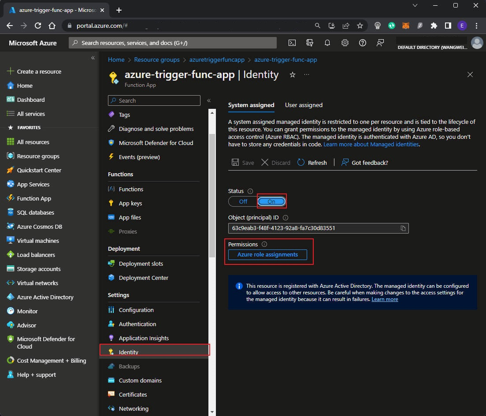
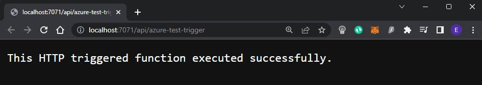
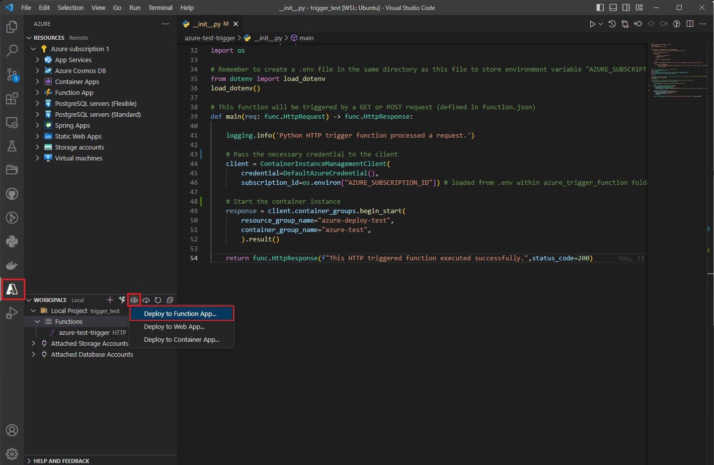
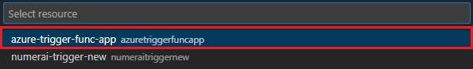
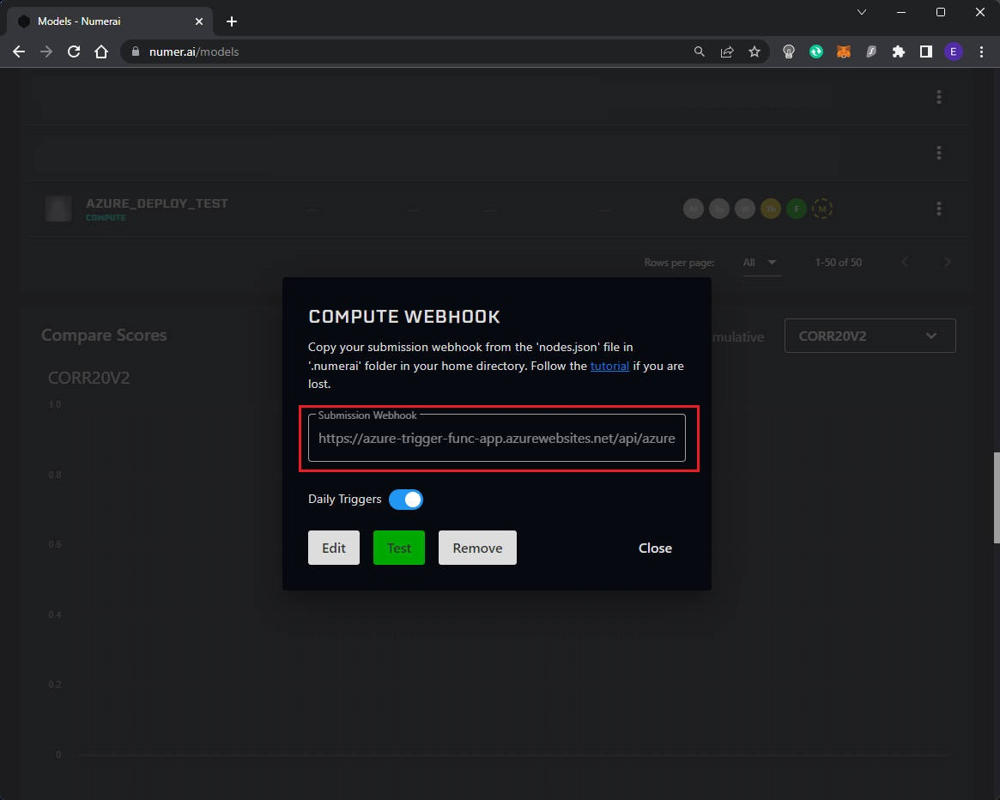
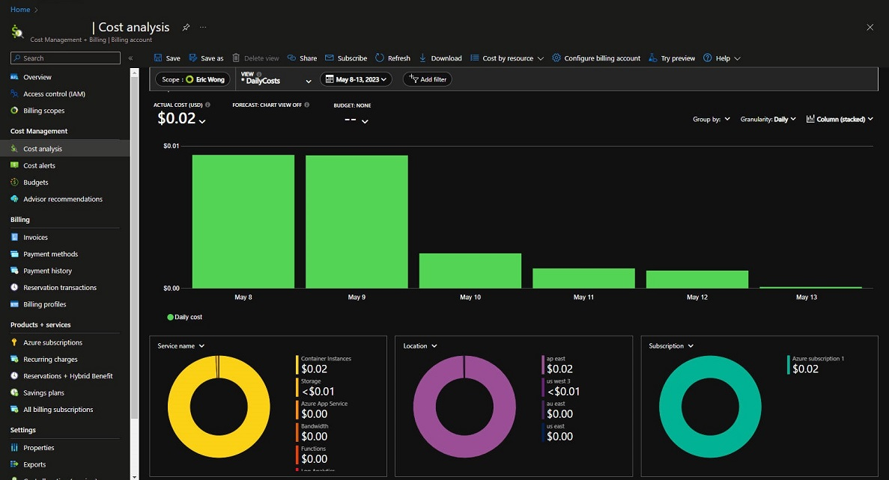

# Numerai <> Azure Daily Submission Example
# Background
Example for **daily Numerai submission on Azure cloud** ☁️☁️. Numerai daily submission window is only 1 hour, and opening time varies. **Staying up late to submit prediction is dumb…** Let's automate it on Azure, as low as <=$1 USD per month.
- **Suitable for**:
  1. Complex submission pipeline, e.g. multiple preprocessing/post-processing scripts
  2. Large compute resource required (large RAM)
  3. Managing multiple models at once

- **Set-up time**: 1-1.5 hour
- **Cost**: <=$1-5 USD per month

# Architecture

# Prerequisites
- [Docker Desktop](https://www.docker.com/products/docker-desktop/)
- [Docker Hub account](https://hub.docker.com/) (or any other container registry)
- [Azure account](https://azure.microsoft.com/en-us/pricing/free-services/)
- [Azure CLI](https://learn.microsoft.com/en-us/cli/azure/install-azure-cli#install) for your OS
- IDE: VS Code
  - VS Code Extensions: Azure Tools, Docker

# Step-by-step guide
- [Step 1: Train models & prepare submission script](#step1)
- [Step 2: Build, Test & Push submission Docker image to Docker Hub](#step2)
  - [Step 2.1: Build submission Docker image](#step2.1)
  - [Step 2.2: Test submission Docker image](#step2.2)
  - [Step 2.3: Push submission Docker image](#step2.3)
- [Step 3: Set-up Azure Container Instance (ACI)](#step3)
- [Step 4: Set-up Azure Function](#step4)
  - [Step 4.1: Create Azure Function App and grant access to the ACI Resource Group](#step4.1)
  - [Step 4.2: Create Azure Function, deploy to Azure Function App](#step4.2)
- [Step 5: Test & deploy Azure Function](#step5)
  - [Step 5.1: Test Azure Function locally](#step5.1)
  - [Step 5.2: Deploy Azure Function to Azure](#step5.2)
  - [Step 5.3: Register Numerai model webhook](#step5.3)

## Step 1: Train models, create Docker image(s) <a name="step1"></a>

- Train your models locally, see ```training.ipynb``` for an example ```LGBMRegressor``` model, then save your model artefects to ```/models``` folder
- Prepare your submission script, see ```predict.py```
- Save submission installation requirements in ```requirements.txt```
- Save environment variables in ```.env``` file, e.g. 
```
NUMERAI_PUBLIC_ID=XXXXXX
NUMERAI_SECRET_KEY=XXXXXX
```

## Step 2: Build, Test & Push Docker image to Docker Hub (or any container registry) <a name="step2"></a>

### Step 2.1: Build submission Docker image  <a name="step2.1"></a>

- Use docker command in VS code terminal ```docker build -t <YOUR_REGISTRY_HOST>/<YOUR_REGISTRY_NAME>[:<version_tag>] .``` to build Docker image from the ```Dockerfile``` in the current directory
  - ```:<version_tag>``` is optional, it is ```latest``` by default
  - Don't forget the ```.```
  

### Step 2.2: Test submission Docker image  <a name="step2.2"></a>

- Test your Docker image locally ```docker run -t <YOUR_REGISTRY_HOST>/<YOUR_REGISTRY_NAME>[:<version_tag>]```, check if your submission is successful 
  - Note: set up Numerai API keys in an ```.env``` file in your directory or declear it as ```ENV NUMERAI_PUBLIC_ID=<YOUR_PUBLIC_ID>```,```ENV NUMERAI_SECRET_KEY=<YOUR_SECRET_KEY>```in your Dockerfile
  

### Step 2.3: Push submission Docker image  <a name="step2.3"></a>

- Push your Docker image with this command ```docker push <YOUR_REGISTRY_HOST>/<YOUR_REGISTRY_NAME>[:<version_tag>]```
  
  

## Step 3: Set-up Azure Container Instance (ACI)<a name="step3"></a>

- Create a Resource Group with Azure cli ```az group create --location westus --name <YOUR_AZURE_RESOURCE_GROUP>``` or in [Azure Portal](https://portal.azure.com/) directly
  - other ```--location``` options: ```eastus```, ```westus``` (cheapest per May 2023), ```southeastasia```, ```eastasia```
- Create a Container Instance with Azure cli ```az container create --resource-group <YOUR_AZURE_RESOURCE_GROUP> --name <YOUR_CONTAINER_INSTANCE_NAME> --restart-policy Never --cpu 1 --memory 2 --image <YOUR_REGISTRY_HOST>/<YOUR_REGISTRY_NAME>[:<version_tag>]```
  - You can change your ```--cpu``` and ```--memory``` based on your container image needs
  - See more examples with```az container create --help```
  - Save your ```<YOUR_AZURE_RESOURCE_GROUP>``` and ```<YOUR_CONTAINER_INSTANCE_NAME>``` as you will need it later
  

## Step 4: Set-up Azure Function as a model webhook to trigger daily submission<a name="step4"></a>

### Step 4.1: Create Azure Function App and grant access to your ACI Resource Group <a name="step4.1"></a>
- Go to VS Code ```Azure``` extension, in ```RESOURCES``` step, click  ```+ (Create Resources)``` to ```Create Function App in Azure```, fill in the required fields. This will create a Function App that store the ```Function``` that will be created


- Configure the Identity of the Function App, go to [Azure Portal](https://portal.azure.com/), select your Function App, go to ```Identity```  turn on ```System assigned``` and click ```Save```
  
- Click ```Add role assignment```, select ```Contributor``` role to your Resource Group for the **Container Instance** (Do not mix up the Resource Group for the Function App and the Container Instance!)
 

### Step 4.2: Create Azure Function (HTTP-triggered), deploy to Azure Function App <a name="step4.2"></a>
- Open ```Azure``` VS Code extension, in ```WORKSPACE``` step, click ⚡```Create Function``` to create a Function
  - ***Recommended to use a new folder*** as the working directory for your Function
  - Language: ```Python```, Python interpreter: ```Python 3.7+```
  - Template: ```HTTP trigger``` 
  - Name your function, e.g.```ModelxxxTrigger``` 
  - Authorization level: ```Anonymous``` 

- Paste the following code to the ```__init__.py``` in your ```/YOUR_FUNCTION_NAME``` Function folder

```python
# If you're using VS Code, press F5 to debug locally
import azure.functions as func
import logging
from azure.mgmt.containerinstance import ContainerInstanceManagementClient
from azure.identity import DefaultAzureCredential
import os

# Remember to create a .env file in the same directory as this file to store environment variable "AZURE_SUBSCRIPTION_ID"
from dotenv import load_dotenv
load_dotenv()

# This function will be triggered by a GET or POST request (defined in function.json)
def main(req: func.HttpRequest) -> func.HttpResponse:
    
    logging.info('Python HTTP trigger function processed a request.')
    
    # Pass the necessary credential to the client
    client = ContainerInstanceManagementClient(
        credential=DefaultAzureCredential(),
        subscription_id=os.environ["AZURE_SUBSCRIPTION_ID"]) # loaded from .env within azure_trigger_function folder
    
    # Start the container instance
    response = client.container_groups.begin_start(
        resource_group_name="<YOUR_AZURE_RESOURCE_GROUP>",
        container_group_name="<YOUR_CONTAINER_INSTANCE_NAME>",
        ).result()
    
    return func.HttpResponse(f"This HTTP triggered function executed successfully.",status_code=200)
```

  - Remember to setup an ```.env``` file to store your ```AZURE_SUBSCRIPTION_ID``` , you may check your subscription id with Azure cli ```az account show``` , or in [Azure Portal](https://portal.azure.com/)
  - See reference ```__init__.py``` in ```/example_trigger_function``` folder

## Step 5: Test and deploy Azure Function locally <a name="step5"></a>

### Step 5.1: Test your Azure Function locally <a name="step5.1"></a>

- You may locally test if the Azure Function works, press ```F5``` (entering Debug mode) on VS Code, the following test link should appear


- Click on the link, wait 1-2 minutes (for the container to run), you should see the following success message! You may check your submission status in [numer.ai/models](https://numer.ai/models)


### Step 5.2: Deploy your Function to the Function App <a name="step5.2"></a>

- Deploy the Function to Azure, click ```Deploy to Function App...```, select the Azure Function App that was created in [Step 4](#step4)



- You will see the **public URL** of your trigger function, which is your model webhook. **Great, the setup on Azure is done!**


### Step 5.3: Register Numerai model webhook <a name="step5.3"></a>

- **Paste the above URL** to your Numerai model compute webhook settings, then click ```Register```, you to see ```Test``` button showing up

  - When you click ```Test```, it might show ```request timeout``` as it takes time for the container instance to run, still, you will see successful submission after 1-2 the container instance finished running. Same for the daily compute trigger email

# ***Congrats! Your daily submission pipeline is set-up!🥳🎉*** You can now enjoy your sleep :)

If you have other any question, feel free to [**raise an issue**](https://github.com/eses-wk/numerai-azure-example/issues)

# FAQ
- Cannot connect to Docker Desktop when using Windows Subsystem for Linux (WSL)
  - Solution:
  
- Daily cost for using the above solution
  
- You can find a simple Cost Calculator in this repo ```Azure_cost_estimate.xlsx```
  


# Reference
- [Guide for Azure Container Instance](https://learn.microsoft.com/en-us/azure/container-instances/container-instances-quickstart#create-a-resource-group)
- [Guide for Azure (HTTP-trigger) Function](https://learn.microsoft.com/en-us/azure/azure-functions/functions-bindings-http-webhook-trigger?pivots=programming-language-python&tabs=python-v1%2Cin-process%2Cfunctionsv2)
- [Azure CLI](https://learn.microsoft.com/en-us/cli/azure/)
- [Numerai-cli](https://github.com/numerai/numerai-cli) for deployment on AWS
- [Numerai API](https://numerapi.readthedocs.io/en/latest/)
